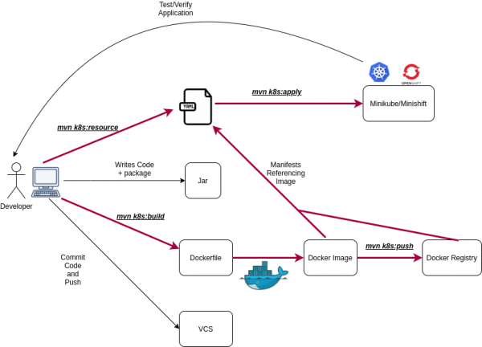

# J K U B E

#### Reference Documentation
* [Eclipse-JKube-introduction-kubernetes-openshift](http://blog.marcnuri.com/eclipse-jkube-introduction-kubernetes-openshift/)
* [Kubernetes-Maven-Plugin](https://www.eclipse.org/jkube/docs/kubernetes-maven-plugin)


#### Development & Deployment Steps

##### Start Docker Desktop

```
minikube start				==>> Start minikube
```
```
mvn clean install			==>> Clean target
```
```
mvn k8s:build				==>> Build images
```
```
docker images				==>> Check images
```
```
mvn k8s:push				==>> Push images to a registry
```
```
mvn k8s:resource			==>> Generate Kubernetes resource descriptors
```
```
mvn k8s:apply				==>> Apply resources to a running cluster
```
```
mvn k8s:help				==>> K8S plugin Help
```
```
minikube service --url=true greeting	==>> Open REST API at browser
```
```
minikube dashboard --url=true		==>> To Open Dashboard
```
```
kubectl logs greeting-c5ff768db-dlllq	==>> To Watch logs of Spring-Boot Application
```


#####[The cloud-native Java workflow simplified with Eclipse JKube]

```
==========================================================
		Development Goals Description
==========================================================
mvn k8s:deploy 				==>> Deploy resources descriptors to a cluster after creating them and building the app. 
              					 Same as k8s:apply except that it runs in the background.
mvn k8s:undeploy 			==>> Undeploy and remove resources descriptors from a cluster.
mvn k8s:watch 				==>> Watch for file changes and perform rebuilds and redeployments
mvn k8s:log 				==>> Show the logs of the running application
mvn k8s:debug 				==>> Enable remote debugging
This setup make some opinionated decisions for you:
    As base image jkube/jkube-java-binary-s2i is chosen which enables Jolokia and jmx_exporter. 
    It will create a Kubernetes Deployment and a Service as resource objects
    It exports port 8080 as the application service port (and 8778 and 9779 for Jolokia and jmx_exporter access, respectively)
==========================================================
```

```
mvn package k8s:build
mvn k8s:push
mvn k8s:resource k8s:deploy
minikube service greeting
minikube.exe ip

```

```
==========================================================
#####  Get Objects/Resource info  #####
kubectl.exe cluster-info
kubectl get pods -w
kubectl get all
kubectl get svc
kubectl logs greeting-bd669bf97-2dvdw
kubectl get ingress
kubectl describe deployment test-webapp

#####  To get all the resources.  #####
kubectl get pods,services,deployments,jobs,daemonset

kubectl delete -f ./deployment.yaml
kubectl delete deployment nginx-deployment
kubectl delete ns <name>

#####  Delete the resources.  #####
kubectl delete deployments <deployment>
kubectl delete services <services>
kubectl delete pods <pods>
kubectl delete daemonset <daemonset>
==========================================================
```


